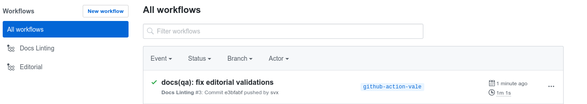

  

  

    <h2>Simplicity First</h2>
    
Minimal setup with markdown-centered project structure helps you focus on writing.

  

  

    <h2>Vue-Powered</h2>
    
Enjoy the dev experience of Vue + webpack, use Vue components in markdown, and develop custom themes with Vue.

  

  

    <h2>Docs As Code</h2>
    
VuePress generates pre-rendered static HTML for each page, and runs as an SPA once a page is loaded.

  

