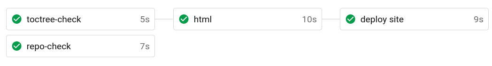
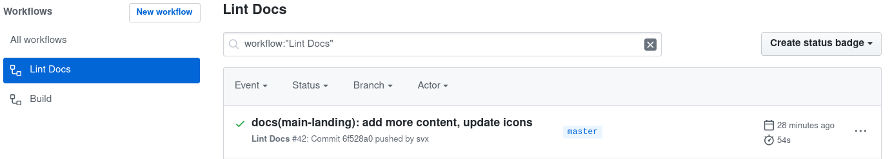
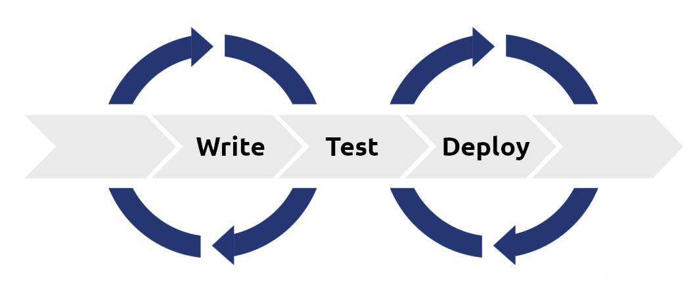

# Introduction

:::tip Key Point
What is VuePress Demo.

:bulb: {{ $page.readingTime.text }}
:::

---

[[toc]]

## About

<DisclaimerMain />

This demo features a [VuePress](https://vuepress.vuejs.org/ "Link to VuePress website") setup tailored for (technical) documentation.

It includes a list of [plugins](https://vuepress.vuejs.org/plugin/ "Link to VuePress plugins") which can enhance the
functionality of VuePress as documentation base.

In addition this setup showcases the usage of [GitHub Actions](https://github.com/features/actions "Link to GitHub Actions on GitHub") for [Docs As Code](#docs-as-code "Docs As Code"),
includes a editorial style guide and one for Markdown.

## Docs As Code

Docs As Code assumes that you use the same tooling for writing documentation which you use for working on your code.

In the same manner that code editors are configured with plugins for reporting coding style violations,
you can configure your code editor with plugins that report inconsistencies with your company's editorial and content style guides.

Depending on your documentation, these could be plugins for checking the consistency of your markup language,
the style of headings, the length of documents and many more.

Consistent, tested documentation can help your product and your development cycle.

Consistency means that you write your documentation according to a defined standard reflecting your product and company.
It also means that you can find information and understand that information when you encounter problems.

Using the same tooling may also include [CI/CD](#continuous-integration)(Continuous Integration).



TODO:

- ADD here CI part and that is does not matter which CI
- Add some words about used QA checks
- Add `VuePress` to `vale` checks

## Quality Assurance

Poor documentation reflects badly on the quality of the product and your company.
A key part of the Docs As Code approach is to apply a Quality Assurance (QA) model in your documentation process.

This means running documentation tests in the same manner that developers run automated tests against the software they are writing.,

Documentation testing is a non-functional test of your content which helps ensure that it stays up-to-date with your product, the installation requirements, and is understandable by your audience.

Docs As Code done right saves you time and money by decreasing the time you spend fixing documentation and increasing its quality.



## Continuous Integration

Docs As Code means today CI/CD.

Does not matter if you use Travis, CircleCi (add here more)

This example uses GitHub Actions




To Check:

Check for/is we want the next plugs

```json
"dependencies": {
    "@vuepress/plugin-back-to-top": "^1.4.1",
    "@vuepress/plugin-google-analytics": "^1.5.0",
    "axios": "^0.19.2",
    "vuepress": "^1.4.1",
    "vuepress-plugin-code-copy": "^1.0.6",
    "vuepress-plugin-reading-time": "^0.1.1",
    "vuepress-plugin-robots": "^1.0.1",
    "vuepress-plugin-sitemap": "^2.3.1"
  },
  "devDependencies": {
    "husky": "^4.2.5",
    "markdown-link-check": "^3.8.1",
    "remark-preset-lint-ocular-d": "0.0.3",
    "vuepress-plugin-autometa": "^0.1.13"
```
